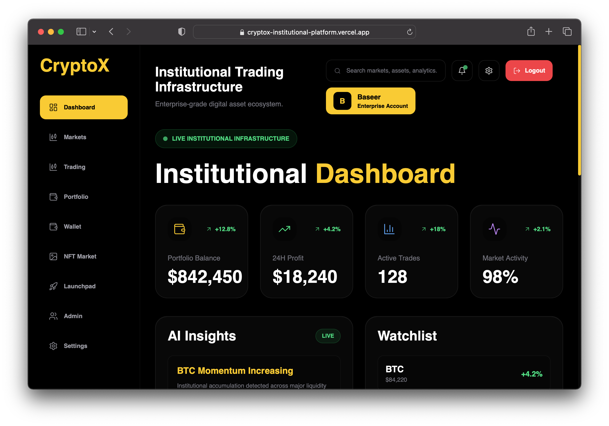
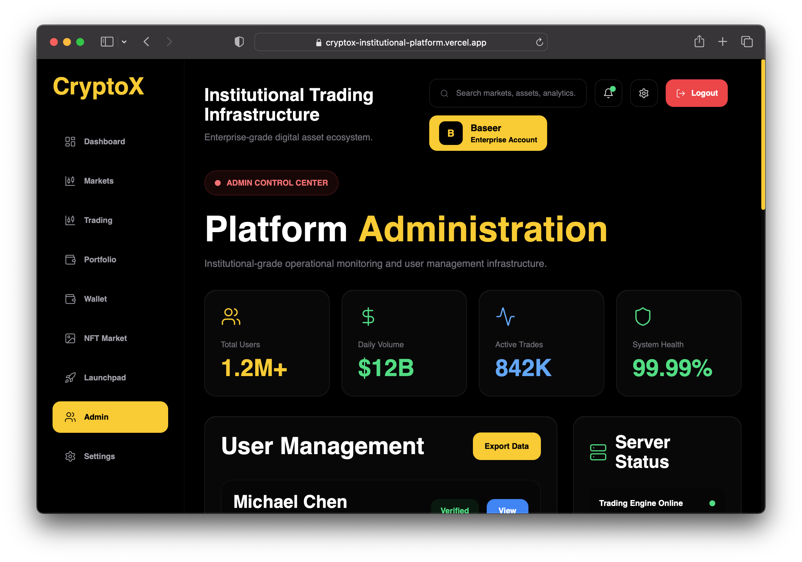

# CryptoX – Institutional Crypto Trading Platform

Premium institutional-grade cryptocurrency trading ecosystem built for modern digital asset markets.

## Live Demo

https://cryptox-institutional-platform.vercel.app

## GitHub Repository

https://github.com/baseerhatif3-oss/cryptox-institutional-platform

---

## Overview

CryptoX is a modern institutional crypto trading platform designed for professional traders, investors, fintech startups and digital asset businesses.

The platform includes advanced market analytics, portfolio management, AI-powered insights, NFT marketplace infrastructure, launchpad functionality, wallet management and enterprise-grade administration tools.

CryptoX was built as a complete cryptocurrency ecosystem prototype with a premium UI/UX inspired by institutional trading platforms.

---

## Key Features

### Trading Infrastructure

- Advanced trading dashboard
- Market overview
- Portfolio tracking
- Real-time asset monitoring
- Performance analytics
- Professional trading interface

### Portfolio Management

- Asset allocation monitoring
- Portfolio balance tracking
- Profit & loss analytics
- Performance reports
- Investment overview

### Wallet System

- Digital asset wallet interface
- Balance management
- Transaction monitoring
- Multi-asset support structure

### NFT Marketplace

- NFT discovery
- NFT listing interface
- Marketplace dashboard
- NFT portfolio tracking

### Launchpad Module

- Project launch management
- Token launch interface
- Startup onboarding system
- Community participation dashboard

### AI Insights

- Market intelligence dashboard
- Trend analysis
- Trading signals interface
- Performance recommendations

### Admin Control Center

- User management
- Platform monitoring
- Analytics dashboard
- Activity reports
- Operational controls
- System status monitoring

### Enterprise UI

- Modern institutional design
- Responsive layout
- Dark premium interface
- Mobile compatibility
- Professional dashboard experience

---

## Screenshots

### Homepage


### Institutional Dashboard



### Admin Control Center



### Markets


---

## Technology Stack

### Frontend

- React
- Vite
- JavaScript
- Tailwind CSS

### Backend

- Node.js
- Express.js

### Database

- MongoDB Ready Architecture

### Deployment

- Vercel

---

## Project Structure

```bash
src/
public/
components/
pages/
assets/

README.md
package.json
vite.config.js
vercel.json
```

---

## Use Cases

CryptoX can be adapted for:

- Crypto Exchanges
- Trading Platforms
- Fintech Startups
- Digital Asset Companies
- Investment Platforms
- Web3 Businesses
- Blockchain Startups
- Institutional Trading Systems

---

## Current Status

- Live Demo Available
- Frontend Operational
- Dashboard Functional
- Admin Panel Functional
- GitHub Repository Included
- Ready For Further Development

---

## Business Opportunity

CryptoX represents a ready-to-scale cryptocurrency platform concept suitable for:

- Startup acquisition
- White-label development
- Fintech expansion
- Web3 product launches
- Institutional trading solutions

---

## Contact

For acquisition inquiries, partnerships or business discussions:

Email:
baseerhatif3@gmail.com

GitHub:
https://github.com/baseerhatif3-oss/cryptox-institutional-platform

---

## License

MIT License

---

## Author

Baseer Hatif

CryptoX Institutional Trading Platform
